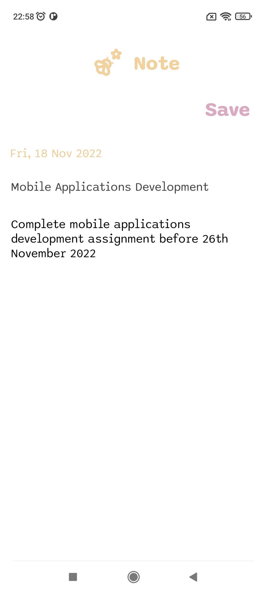

# Notes App
Notes app is a simple note taking app built with jetpack compose. The app uses viewmodel to store the notes. The app is built with the following features:

- Add a note
- Delete a note
- View saved notes

**UI SCREENSHOTS**

