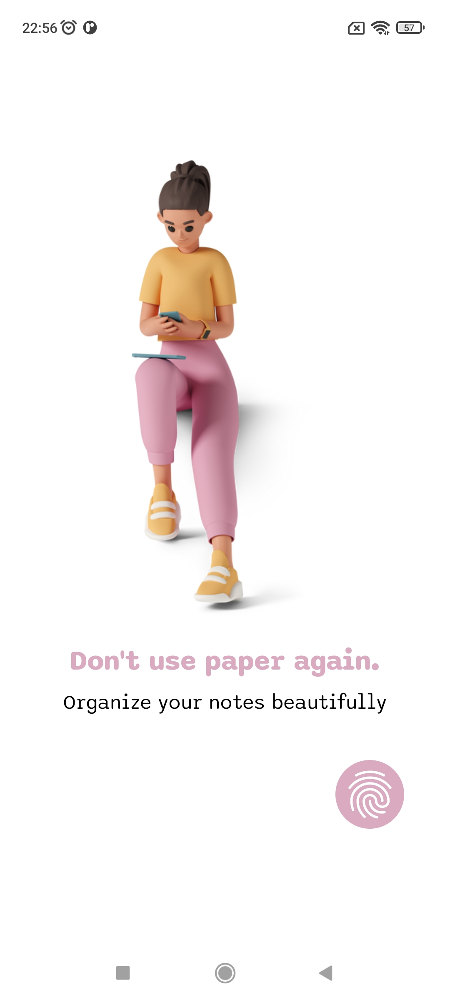
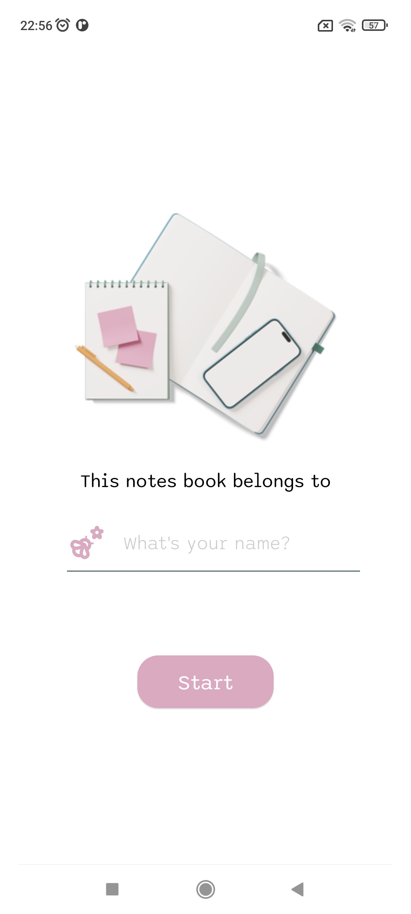
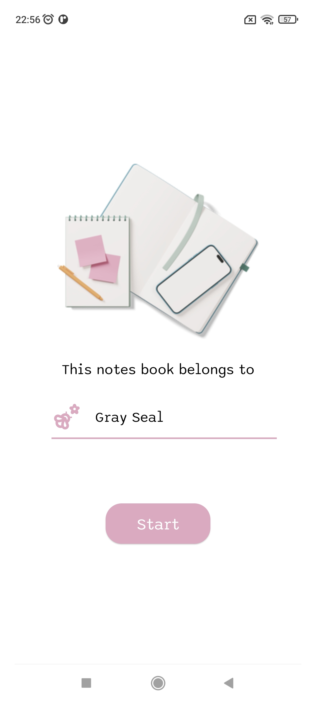
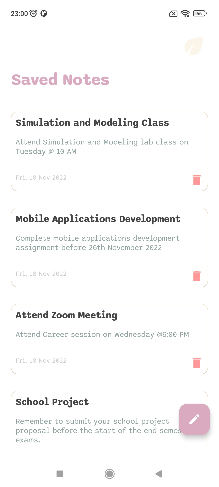

# Notes App
Notes app is a simple note taking app built with jetpack compose. The app uses Room database to store notes and uses Hilt for dependency injection. It also uses Jetpack Navigation for navigation between screens.

The app is still missing some features like editing notes and adding images to notes. I will be adding these features in the future.

**Available features:**
- Add a note
- Delete a note
- View saved notes

**UI SCREENSHOTS**

